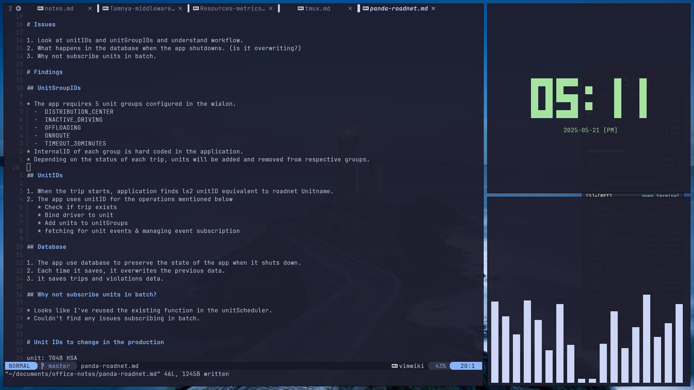

# dotfiles

[](https://github.com/prakhil-tp/dotfiles/search?l=vim%20script)
[](https://github.com/prakhil-tp/dotfiles/tags)
[](https://github.com/Prakhil-tp/dotfiles/commits/master)



Configuration files that are used to customize your Linux or unix-like systems. 

## Configs

- [Alacritty](https://github.com/Prakhil-tp/dotfiles/tree/master/Alacritty/.config/)
- [Awesome WM](https://github.com/Prakhil-tp/dotfiles/tree/master/awesome/.config/awesome)
- [Bash](https://github.com/Prakhil-tp/dotfiles/tree/master/bash/)
- [Bat](https://github.com/Prakhil-tp/dotfiles/tree/master/bat/.config/bat/)
- [Conky](https://github.com/Prakhil-tp/dotfiles/tree/master/conky/.config/conky/)
- [Devilspie 2](https://github.com/Prakhil-tp/dotfiles/tree/master/devilspie2/.config/devilspie2/)
- [Dm-scripts](https://github.com/Prakhil-tp/dotfiles/tree/master/dm-scripts/scripts)
- [Doom Emacs](https://github.com/Prakhil-tp/dotfiles/tree/master/emacs/)
- [Fzf](https://github.com/Prakhil-tp/dotfiles/tree/master/fzf/.local/share/fzf)
- [Lsd](https://github.com/Prakhil-tp/dotfiles/tree/master/lsd/.config/lsd)
- [Mutt](https://github.com/Prakhil-tp/dotfiles/tree/master/mutt/.config/mutt/)
- [Neovim](https://github.com/Prakhil-tp/dotfiles/tree/master/nvim/.config/nvim/)
- [Nvm](https://github.com/Prakhil-tp/dotfiles/tree/master/nvm/)
- [Picom](https://github.com/Prakhil-tp/dotfiles/tree/master/picom/.config/picom)
- [Rofi](https://github.com/Prakhil-tp/dotfiles/tree/master/rofi/.config/rofi)
- [Tmux](https://github.com/Prakhil-tp/dotfiles/tree/master/tmux/)
- [Ufetch](https://github.com/Prakhil-tp/dotfiles/tree/master/ufetch)
- [Vifm](https://github.com/Prakhil-tp/dotfiles/tree/master/vifm/.config/vifm/)
- [Xmonad](https://github.com/Prakhil-tp/dotfiles/tree/master/xmonad/.xmonad)
- [Zathura](https://github.com/Prakhil-tp/dotfiles/tree/master/zathura/.config/zathura)
- [Zsh](https://github.com/Prakhil-tp/dotfiles/tree/master/zsh/)

## How to use

1. Clone the repository to home directory
2. Let the `stow` to do the job. (stow will create corresponding config symlinks in appropriate directories.)

``` sh
git clone https://github.com/Prakhil-tp/dotfiles.git
cd ./dotfiles
stow <directory-name>      #  add a purticular config. example: $ stow alacritty
```

